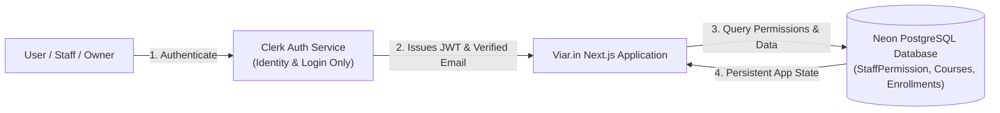

# Architectural Overview & Access Control Reference

## 1. Identity (Clerk) vs. Application Data (PostgreSQL)

> [!IMPORTANT]
> **Plain-Language Summary for Non-Technical Stakeholders & Operators:**
> **Clerk handles identity/login only** and works completely independently of this application's own database.
>
> All application-specific data—including **staff permissions, student enrollments, quiz submissions, issued certificates, live class recording links, and payment records**—lives in this application's own PostgreSQL database (provisioned on Neon).
>
> **What this means in practice:**
> 1. You can successfully log in with Google or Email via Clerk even if no database is connected; this does **not** mean the entire site is operating.
> 2. Until a real production database is connected via `DATABASE_URL`, application data will not persist, and features like issuing certificates, granting staff access, or enrolling students will run in temporary in-memory mock mode.
> 3. During local development, test data stored in the browser's local state will reset when clearing cookies or testing on a new device. Connecting your production Neon PostgreSQL database makes all data permanent and synchronized across all devices.



---

## 2. Site Owner Designation Mechanism

### Architecture & Security Guarantees
- The Site Owner is the client himself (**Acharya Niraj Kumar**).
- The Owner role is **distinct** from general "admin" or "instructor" roles.
- The Owner has universal, unrestricted access to every section of the platform and is never subject to section-level restriction checks.
- The Owner is the **only account** permitted to view and manage team staff permissions at `/admin/team`.

### How an Account Becomes Owner
1. The primary owner email is configured via the environment variable `OWNER_EMAIL`:
   ```bash
   OWNER_EMAIL="ask@aapkaastro.com"
   ```
2. When a user registers or logs in via Clerk, application code checks their verified email against `OWNER_EMAIL`.
3. If and only if the verified email matches, the account is automatically granted `isOwner: true` and `role: 'OWNER'`.
4. **Anti-Tampering Guarantee:** Non-owner accounts can never self-assign the `OWNER` role, even by altering client-side payloads, URL parameters, or database role requests. Automated tests in `tests/permissions.test.ts` prove this security invariant.

### Pre-Go-Live Action Required
> [!WARNING]
> Before going live in production, the client must verify that **`OWNER_EMAIL`** is set in the hosting environment (e.g., Vercel / Railway) to his real email address:
> ```bash
> OWNER_EMAIL=ask@aapkaastro.com
> ```

---

## 3. Zero-Cost Staff Permissions System ($0 Clerk Org Fees)

### Cost & Isolation Rationale
- **Zero Ongoing Fees:** Clerk's custom Organizations and permissions feature costs an expensive monthly base fee plus per-seat add-ons. By storing granular staff permissions in our own free Neon Postgres table (`StaffPermission`) and validating them in server-side application code, we achieve equivalent enterprise-grade security at **\$0 additional cost**.
- **Strict Per-Site Isolation:** Granting a staff member access to a section on Viar.in (e.g. `courses:MANAGE`) does **not** give them access to Aapka Astro or DOW Consulting. Each platform maintains its own isolated database permission table.

### Section Identifiers for Viar.in
The platform uses 6 standardized section identifiers:
1. `courses` — Course catalog, pricing, syllabi blocks, and descriptions.
2. `cohorts` — Cohort dates, Zoom/Meet links, and class recording vaults.
3. `students` — Enrolled student roster, manual admissions, and attendance.
4. `quizzes` — 20-question certification exams, pass thresholds, and certificate issuance.
5. `analytics` — Student completion rates, video watch telemetry, and platform stats.
6. `payments` — Razorpay / Stripe transaction receipts and revenue telemetry.
7. `staff` — Team permission management (`/admin/team`), strictly reserved for the Site Owner.

### Access Levels: `VIEW` vs. `MANAGE`
- **`VIEW`**: Read-only permission. Staff can inspect rosters, examine course lists, or review test questions, but cannot add, edit, or delete records.
- **`MANAGE`**: Full read-write permission. Staff can publish courses, update Zoom links, upload recordings, and grade exams.

### Soft-Revocation Audit Trail
- To ensure full compliance and accountability, permissions are never hard-deleted from the database.
- Revoking access sets `revokedAt = NOW()`, instantly terminating the staff member's active privileges while preserving the complete audit history (who granted it, when it was granted, and when it was revoked).

---

## 4. Server-Side Route & API Gating Matrix

Every administrative route and mutating API endpoint enforces server-side permission checks on every single request:

| Route / Endpoint | Required Section | Minimum Level | Non-Owner Staff with wrong section | Site Owner |
|---|---|---|---|---|
| `/admin/team` | `staff` | Owner-Only | **Rejected (Redirect / 403)** | **Allowed** |
| `/api/admin/team` | `staff` | Owner-Only | **Rejected (HTTP 403)** | **Allowed** |
| `/instructor/courses` | `courses` | `VIEW` | **Access Restricted Banner** | **Allowed** |
| `/api/courses` (POST) | `courses` | `MANAGE` | **Rejected (HTTP 403)** | **Allowed** |
| `/api/cohorts` (POST) | `cohorts` | `MANAGE` | **Rejected (HTTP 403)** | **Allowed** |
| `/api/sessions` (PATCH)| `cohorts` | `MANAGE` | **Rejected (HTTP 403)** | **Allowed** |
| `/instructor/students`| `students` | `VIEW` | **Access Restricted Banner** | **Allowed** |
| `/instructor/analytics`| `analytics` | `VIEW` | **Access Restricted Banner** | **Allowed** |
